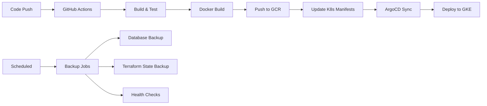

# CI/CD Pipeline Documentation

This document provides comprehensive setup and usage instructions for the Bro AI CI/CD pipeline using GitHub Actions, ArgoCD, and GCP.

## 🏗️ Architecture Overview

The CI/CD pipeline consists of three main components:

- **GitHub Actions**: Build, test, and container image creation
- **ArgoCD**: GitOps-style continuous deployment
- **GCP Integration**: Backup automation and infrastructure management

### Pipeline Flow



## 📋 Prerequisites

1. **GitHub Repository**: With admin access for secrets configuration
2. **GCP Project**: With billing enabled and APIs activated
3. **GKE Cluster**: Deployed using the Terraform infrastructure
4. **Domain Name**: For ArgoCD web interface (optional but recommended)

## 🔐 GitHub Secrets Configuration

### Required Secrets

Configure these secrets in your GitHub repository (Settings → Secrets and variables → Actions):

#### **GCP Authentication**
```bash
GCP_SA_KEY                  # Service account key (JSON format)
GCP_PROJECT_ID              # Your GCP project ID
```

#### **ArgoCD Configuration**
```bash
ARGOCD_SERVER              # ArgoCD server URL (e.g., argocd.your-domain.com)
ARGOCD_USERNAME            # ArgoCD username (usually 'admin')
ARGOCD_PASSWORD            # ArgoCD admin password
```

#### **Container Registry**
```bash
# These are usually included in GCP_SA_KEY, but can be separate:
GCR_HOSTNAME               # gcr.io (or your preferred registry)
GCR_PROJECT_ID             # Same as GCP_PROJECT_ID typically
```

#### **Notifications (Optional)**
```bash
SLACK_WEBHOOK_URL          # Slack webhook for deployment notifications
CODECOV_TOKEN              # Codecov token for coverage reports
```

### Generating GCP Service Account Key

1. **Create Service Account**:
   ```bash
   gcloud iam service-accounts create github-actions \
     --display-name="GitHub Actions CI/CD" \
     --description="Service account for GitHub Actions workflows"
   ```

2. **Assign Required Roles**:
   ```bash
   PROJECT_ID="your-project-id"
   SA_EMAIL="github-actions@$PROJECT_ID.iam.gserviceaccount.com"
   
   # Core CI/CD roles
   gcloud projects add-iam-policy-binding $PROJECT_ID \
     --member="serviceAccount:$SA_EMAIL" \
     --role="roles/container.admin"
   
   gcloud projects add-iam-policy-binding $PROJECT_ID \
     --member="serviceAccount:$SA_EMAIL" \
     --role="roles/storage.admin"
   
   gcloud projects add-iam-policy-binding $PROJECT_ID \
     --member="serviceAccount:$SA_EMAIL" \
     --role="roles/cloudsql.admin"
   
   # Terraform state access
   gcloud projects add-iam-policy-binding $PROJECT_ID \
     --member="serviceAccount:$SA_EMAIL" \
     --role="roles/viewer"
   ```

3. **Generate and Download Key**:
   ```bash
   gcloud iam service-accounts keys create github-actions-key.json \
     --iam-account=$SA_EMAIL
   ```

4. **Add to GitHub Secrets**:
   - Copy the entire contents of `github-actions-key.json`
   - Paste as the value for `GCP_SA_KEY` secret

## 🚀 Setup Instructions

### 1. Infrastructure Preparation

First, ensure your infrastructure is deployed:

```bash
# Deploy infrastructure using Terraform
cd terraform
make deploy-stage    # Deploy staging environment
make deploy-prod     # Deploy production environment
```

### 2. ArgoCD Installation

Install ArgoCD on your GKE cluster:

```bash
# Get GKE credentials
gcloud container clusters get-credentials stage-gke-cluster --region us-central1

# Install ArgoCD using the provided script
./ci/setup-scripts/install-argocd.sh \
  --project-id your-project-id \
  --github-org your-github-org \
  --domain your-domain.com
```

### 3. GitHub Repository Configuration

1. **Enable GitHub Actions**:
   - Go to repository Settings → Actions → General
   - Allow all actions and reusable workflows

2. **Configure Environments**:
   - Go to Settings → Environments
   - Create `staging` and `production` environments
   - Add protection rules for production (require reviews)

3. **Add Repository Secrets**:
   - Go to Settings → Secrets and variables → Actions
   - Add all required secrets listed above

### 4. Docker Configuration

Create a Dockerfile in your project root:

```dockerfile
# Multi-stage build for Rust application
FROM rust:1.70 as builder

WORKDIR /app
COPY Cargo.toml Cargo.lock ./
COPY src ./src

# Build the application
RUN cargo build --release

# Runtime stage
FROM debian:bookworm-slim

RUN apt-get update && apt-get install -y \
    ca-certificates \
    libssl3 \
    && rm -rf /var/lib/apt/lists/*

WORKDIR /app

# Copy binary from builder stage
COPY --from=builder /app/target/release/bro-ai /app/bro-ai

# Create non-root user
RUN useradd -r -u 1000 appuser
USER appuser

EXPOSE 8080
CMD ["./bro-ai"]
```

## 📊 Workflow Details

### Build & Test Workflow (`.github/workflows/build.yml`)

**Triggers**: Push to `main`/`develop`, Pull Requests  
**Purpose**: Validate code quality and build artifacts

**Jobs**:
- **Lint**: Code formatting and Clippy checks
- **Test**: Run tests on multiple Rust versions
- **Build**: Compile for multiple targets
- **Coverage**: Generate code coverage reports
- **Docker Build**: Create and push container images
- **Security Scan**: Vulnerability scanning with Trivy

### Deploy Workflow (`.github/workflows/deploy.yml`)

**Triggers**: Push to `main`/`develop`, Manual dispatch  
**Purpose**: Deploy applications using ArgoCD

**Jobs**:
- **Get Infrastructure Info**: Extract cluster details from Terraform
- **Deploy Staging**: Automatic deployment to staging
- **Deploy Production**: Manual deployment to production
- **Notifications**: Slack notifications on success/failure

### Backup Workflow (`.github/workflows/backup.yml`)

**Triggers**: Daily schedule (2 AM UTC), Manual dispatch  
**Purpose**: Automated backup and health checking

**Jobs**:
- **Database Backup**: Cloud SQL backups and exports
- **Terraform State Backup**: Infrastructure state preservation
- **Secrets Backup**: Metadata backup for Secret Manager
- **Cleanup**: Remove old backups
- **Health Check**: Infrastructure drift detection

## 🔄 Usage Guide

### Triggering Deployments

#### Automatic Deployments
- **Staging**: Push to `develop` branch
- **Production**: Push to `main` branch (requires approval)

#### Manual Deployments
1. Go to Actions → Deploy workflow
2. Click "Run workflow"
3. Select environment and options
4. Click "Run workflow"

### Managing Secrets

#### Adding New Secrets
1. **In GCP Secret Manager**:
   ```bash
   gcloud secrets create new-secret-name --data-file=secret-file.txt
   ```

2. **In Kubernetes**:
   ```bash
   kubectl create secret generic new-secret \
     --from-literal=key=value \
     --namespace=staging
   ```

3. **Update Kubernetes manifests** to reference the new secret

### Monitoring Deployments

#### ArgoCD Web Interface
- Access: `https://argocd.your-domain.com`
- Login with admin credentials
- Monitor application sync status

#### GitHub Actions
- Go to repository → Actions tab
- View workflow runs and logs
- Monitor deployment status

#### GCP Console
- **GKE**: Check cluster and pod status
- **Cloud SQL**: Monitor database health
- **Cloud Storage**: Verify backup completion

## 🛠️ Troubleshooting

### Common Issues

#### 1. **Build Failures**
```bash
# Check Rust toolchain
rustc --version
cargo --version

# Update dependencies
cargo update

# Clear cache
cargo clean
```

#### 2. **Docker Build Issues**
```bash
# Test build locally
docker build -t test-image .

# Check for layer caching issues
docker build --no-cache -t test-image .
```

#### 3. **ArgoCD Sync Issues**
```bash
# Check application status
kubectl get applications -n argocd

# Force sync
argocd app sync bro-ai-staging --force

# Check logs
kubectl logs -n argocd deployment/argocd-application-controller
```

#### 4. **Authentication Problems**
```bash
# Verify service account permissions
gcloud projects get-iam-policy your-project-id

# Test gcloud authentication
gcloud auth application-default print-access-token

# Check Workload Identity
kubectl describe serviceaccount bro-ai-sa -n staging
```

### Debugging Commands

```bash
# Check GitHub Actions logs
gh run list --repo your-org/bro-ai-infra
gh run view RUN_ID --log

# Verify ArgoCD applications
argocd app list
argocd app get bro-ai-staging

# Check Kubernetes resources
kubectl get all -n staging
kubectl describe pod POD_NAME -n staging

# Verify secrets
kubectl get secrets -n staging
gcloud secrets list
```

## 📈 Monitoring and Metrics

### Key Metrics to Monitor

#### CI/CD Pipeline
- **Build Success Rate**: >95%
- **Build Duration**: <10 minutes
- **Deployment Frequency**: Track daily/weekly deployments
- **Lead Time**: From commit to production

#### Infrastructure Health
- **Cluster Uptime**: >99.9%
- **Pod Restart Rate**: <5% daily
- **Resource Utilization**: CPU/Memory <80%
- **Backup Success Rate**: 100%

### Setting Up Alerts

1. **Slack Notifications**:
   - Configure webhook URL in secrets
   - Customize notification messages in workflows

2. **Email Alerts**:
   - Use GitHub notification settings
   - Configure GCP monitoring alerts

3. **Custom Dashboards**:
   - Create Grafana dashboards for metrics
   - Use Google Cloud Monitoring

## 🔒 Security Best Practices

### Secrets Management
- ✅ Use GitHub Secrets for sensitive data
- ✅ Rotate service account keys regularly
- ✅ Limit secret access with environment protection
- ✅ Use Workload Identity in Kubernetes

### Container Security
- ✅ Use non-root users in containers
- ✅ Scan images for vulnerabilities
- ✅ Use minimal base images
- ✅ Enable security contexts

### Network Security
- ✅ Private GKE clusters
- ✅ Network policies for pod communication
- ✅ IAP for ArgoCD access
- ✅ TLS encryption everywhere

## 📚 Additional Resources

### Documentation Links
- [GitHub Actions Documentation](https://docs.github.com/en/actions)
- [ArgoCD Documentation](https://argo-cd.readthedocs.io/)
- [GKE Best Practices](https://cloud.google.com/kubernetes-engine/docs/best-practices)
- [Terraform GCP Provider](https://registry.terraform.io/providers/hashicorp/google/latest/docs)

### Example Commands

#### Deploy Specific Image Tag
```bash
# Update image tag in manifests
sed -i 's/image: gcr.io\/PROJECT\/bro-ai:.*/image: gcr.io\/PROJECT\/bro-ai:v1.2.3/' k8s-manifests/staging/deployment.yaml

# Commit and push
git add k8s-manifests/staging/deployment.yaml
git commit -m "Deploy v1.2.3 to staging"
git push
```

#### Manual Backup
```bash
# Trigger backup workflow
gh workflow run backup.yml \
  --field environment=production \
  --field backup_type=full
```

#### Rollback Deployment
```bash
# Via ArgoCD
argocd app rollback bro-ai-production

# Via kubectl
kubectl rollout undo deployment/bro-ai-app -n production
```

This CI/CD pipeline provides a robust, secure, and automated deployment process for the Bro AI infrastructure, with comprehensive monitoring and backup capabilities. 