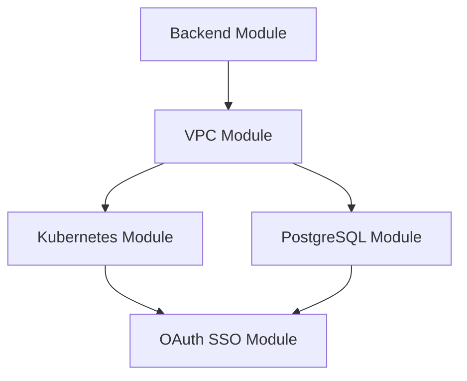

# Project Specification - Bro AI Infrastructure

This document provides the comprehensive specification for the Bro AI project infrastructure, outlining requirements, architecture decisions, and implementation details.

## Project Overview

### Mission Statement
The Bro AI infrastructure provides a scalable, secure, and cost-effective cloud platform for deploying and managing AI-powered applications on Google Cloud Platform.

### Objectives
- **Scalability**: Support growth from MVP to enterprise scale
- **Security**: Implement defense-in-depth security model
- **Reliability**: Achieve 99.9% uptime with robust disaster recovery
- **Cost Efficiency**: Optimize costs through automation and right-sizing
- **Developer Experience**: Provide streamlined deployment and debugging tools

### Scope
This specification covers the complete infrastructure layer including:
- Cloud infrastructure provisioning and management
- Container orchestration and application runtime
- Database and storage solutions
- Security and identity management
- Monitoring and observability
- CI/CD and deployment automation

## Technical Requirements

### Performance Requirements

#### Scalability Targets
- **Horizontal Scaling**: Support 1-1000+ concurrent users
- **Geographic Distribution**: Multi-region deployment capability
- **Auto-scaling**: Automatic resource adjustment based on demand
- **Database Scaling**: Read replicas and connection pooling

#### Performance Metrics
- **API Response Time**: < 200ms for 95th percentile
- **Database Query Time**: < 100ms for 95th percentile
- **Container Startup Time**: < 30 seconds
- **Build and Deployment Time**: < 10 minutes

### Availability Requirements

#### Uptime Targets
- **Production**: 99.9% uptime (8.76 hours downtime/year)
- **Staging**: 99.5% uptime (43.8 hours downtime/year)
- **Maintenance Windows**: Scheduled during low-traffic periods

#### Disaster Recovery
- **Recovery Time Objective (RTO)**: 4 hours
- **Recovery Point Objective (RPO)**: 15 minutes
- **Backup Frequency**: Daily automated backups
- **Geographic Redundancy**: Cross-region backup replication

### Security Requirements

#### Data Protection
- **Encryption at Rest**: All data encrypted using AES-256
- **Encryption in Transit**: TLS 1.2+ for all communications
- **Key Management**: Customer-managed encryption keys (CMEK)
- **Data Classification**: Sensitive data identification and protection

#### Access Control
- **Authentication**: Multi-factor authentication required
- **Authorization**: Role-based access control (RBAC)
- **Network Security**: Private subnets and firewall rules
- **API Security**: OAuth 2.0 and rate limiting

#### Compliance
- **Audit Logging**: Comprehensive audit trail
- **Data Retention**: Configurable retention policies
- **Privacy Controls**: GDPR compliance capabilities
- **Security Scanning**: Regular vulnerability assessments

## Architecture Specifications

### Infrastructure Architecture

#### Cloud Platform Selection
- **Primary Provider**: Google Cloud Platform
- **Reasoning**: 
  - Comprehensive AI/ML services
  - Strong Kubernetes integration
  - Global network infrastructure
  - Competitive pricing for compute and storage

#### Multi-Environment Strategy
```yaml
Environments:
  Production:
    Purpose: Live user-facing environment
    Uptime: 99.9% SLA
    Scaling: Full auto-scaling enabled
    Security: Maximum security controls
    Monitoring: Real-time alerting
    
  Staging:
    Purpose: Pre-production testing
    Uptime: 99.5% SLA
    Scaling: Limited auto-scaling
    Security: Production-like security
    Monitoring: Development-focused metrics
    
  Development:
    Purpose: Developer testing (optional)
    Uptime: No SLA
    Scaling: Manual scaling
    Security: Basic security controls
    Monitoring: Debug-level logging
```

### Network Architecture

#### VPC Design
```yaml
Production VPC (10.0.0.0/16):
  Public Subnet: 10.0.1.0/24
    - GKE nodes with external connectivity
    - Load balancers and ingress controllers
    - NAT gateways
    
  Private Subnet: 10.0.2.0/24
    - Database instances
    - Internal services
    - Backup and monitoring systems
    
  Pod Networks: 10.1.0.0/16
    - Kubernetes pod IP allocation
    - 65,536 available IP addresses
    
  Service Networks: 10.2.0.0/16
    - Kubernetes service IP allocation
    - Load balancer backends

Staging VPC (10.10.0.0/16):
  Public Subnet: 10.10.1.0/24
  Private Subnet: 10.10.2.0/24
  Pod Networks: 10.11.0.0/16
  Service Networks: 10.12.0.0/16
```

#### Security Controls
- **Firewall Rules**: Minimal required access only
- **Private Google Access**: Secure access to Google services
- **Cloud NAT**: Outbound internet access for private resources
- **Network Policies**: Pod-to-pod traffic control

### Compute Architecture

#### Kubernetes Configuration
```yaml
GKE Cluster Specifications:
  Type: Regional private cluster
  Master Version: Stable channel (auto-upgraded)
  Node Pools:
    Production:
      Machine Type: e2-standard-2 (2 vCPU, 8GB RAM)
      Min Nodes: 2
      Max Nodes: 10
      Disk Size: 100GB SSD
      Preemptible: false
      
    Staging:
      Machine Type: e2-medium (1 vCPU, 4GB RAM)
      Min Nodes: 1
      Max Nodes: 5
      Disk Size: 50GB SSD
      Preemptible: true
```

#### Auto-scaling Strategy
- **Horizontal Pod Autoscaler**: CPU and memory-based scaling
- **Vertical Pod Autoscaler**: Right-sizing recommendations
- **Cluster Autoscaler**: Node pool scaling based on pod demands
- **Custom Metrics**: Application-specific scaling triggers

### Data Architecture

#### Database Design
```yaml
Cloud SQL PostgreSQL:
  Production:
    Instance: db-custom-2-4096 (2 vCPU, 4GB RAM)
    Storage: 100GB SSD
    Availability: Regional (multi-zone)
    Backups: 30-day retention
    Maintenance: Sunday 3AM
    
  Staging:
    Instance: db-f1-micro (1 shared vCPU, 0.6GB RAM)
    Storage: 20GB HDD
    Availability: Zonal (single-zone)
    Backups: 7-day retention
    Maintenance: Any time
```

#### Storage Strategy
- **Application Data**: Cloud SQL PostgreSQL
- **File Storage**: Google Cloud Storage buckets
- **Session Storage**: Redis (Cloud Memorystore)
- **Logs**: Cloud Logging with BigQuery export
- **Metrics**: Cloud Monitoring with Prometheus

### Security Architecture

#### Identity and Access Management
```yaml
Authentication:
  Method: OAuth 2.0 with Google Identity
  MFA: Required for admin access
  Session: JWT tokens with 8-hour expiry
  
Authorization:
  Model: Role-based access control (RBAC)
  Roles:
    - Admin: Full infrastructure access
    - Developer: Limited environment access
    - Viewer: Read-only access
    
Service Authentication:
  Method: Workload Identity
  Scope: Minimal required permissions
  Rotation: Automatic key rotation
```

#### Network Security
- **Private Clusters**: No public IP addresses on nodes
- **Authorized Networks**: Restricted master endpoint access
- **SSL/TLS**: End-to-end encryption
- **Certificate Management**: Automated certificate provisioning

## Implementation Specifications

### Infrastructure as Code

#### Terraform Implementation
```yaml
Structure:
  modules/: Reusable infrastructure components
    - vpc/: Network infrastructure
    - kubernetes/: GKE cluster configuration
    - postgresql/: Database setup
    - oauth-sso/: Identity management
    
  environments/: Environment-specific configurations
    - prod/: Production environment
    - stage/: Staging environment
    
  backend/: Remote state management
    - GCS bucket for state storage
    - State locking with Cloud Storage
```

#### Module Dependencies


### Deployment Specifications

#### CI/CD Pipeline
```yaml
Source Control:
  Platform: GitHub
  Branching: GitFlow model
  Protection: Required reviews and checks
  
Build Process:
  Trigger: Push to main branch
  Steps:
    1. Code quality checks
    2. Security scanning
    3. Terraform validation
    4. Plan generation
    5. Approval gate
    6. Infrastructure deployment
    
Deployment Strategy:
  Method: Blue-green deployment
  Rollback: Automatic on health check failure
  Monitoring: Real-time health monitoring
```

#### Environment Promotion
1. **Development**: Feature branch testing
2. **Staging**: Integration testing and UAT
3. **Production**: Live deployment with monitoring

### Monitoring and Observability

#### Metrics Collection
```yaml
Infrastructure Metrics:
  - CPU, memory, disk utilization
  - Network throughput and latency
  - Database performance metrics
  - Storage usage and IOPS
  
Application Metrics:
  - Request rate and response time
  - Error rate and types
  - User session metrics
  - Business logic metrics
  
Security Metrics:
  - Authentication attempts
  - Authorization failures
  - Network intrusion attempts
  - Vulnerability scan results
```

#### Alerting Strategy
- **Critical Alerts**: Immediate notification (SMS, phone)
- **Warning Alerts**: Email notification within 15 minutes
- **Info Alerts**: Dashboard notification only
- **Escalation**: Automatic escalation after 30 minutes

## Operational Specifications

### Backup and Recovery

#### Backup Strategy
```yaml
Database Backups:
  Frequency: Daily automated backups
  Retention: 30 days (prod), 7 days (staging)
  Type: Full backup with transaction log
  Storage: Cross-region replication
  
Infrastructure Backups:
  State Files: Version controlled in Git
  Configurations: Terraform modules and variables
  Secrets: Secure backup procedures
  
Application Backups:
  Container Images: Artifact Registry
  Source Code: Git repository
  Configuration: ConfigMaps and Secrets
```

#### Recovery Procedures
1. **Database Recovery**: Point-in-time restoration
2. **Infrastructure Recovery**: Terraform redeployment
3. **Application Recovery**: Container redeployment
4. **Validation**: Automated testing of recovered systems

### Maintenance and Updates

#### Update Strategy
```yaml
Operating System:
  Method: Automatic node pool updates
  Schedule: During maintenance windows
  Testing: Staging environment first
  
Kubernetes:
  Method: Managed GKE updates
  Channel: Stable release channel
  Schedule: Google-managed
  
Applications:
  Method: Rolling updates
  Strategy: Blue-green deployment
  Rollback: Automatic on failure
```

#### Maintenance Windows
- **Production**: Sunday 2-6 AM UTC
- **Staging**: Any time
- **Emergency**: As needed with approval

## Cost Management

### Budget Planning
```yaml
Monthly Budget Targets:
  Production: $500-1000 USD
  Staging: $100-200 USD
  Development: $50-100 USD
  
Cost Optimization:
  - Preemptible instances for non-critical workloads
  - Auto-scaling to minimize idle resources
  - Storage lifecycle policies
  - Reserved instances for predictable workloads
```

### Cost Monitoring
- **Budget Alerts**: 50%, 80%, 100% thresholds
- **Resource Tracking**: Per-service cost allocation
- **Optimization**: Monthly cost review and optimization
- **Forecasting**: Quarterly budget planning

## Quality Assurance

### Testing Strategy
```yaml
Infrastructure Testing:
  - Terraform plan validation
  - Security policy testing
  - Disaster recovery testing
  - Performance testing
  
Application Testing:
  - Unit tests (80%+ coverage)
  - Integration tests
  - Load testing
  - Security testing
```

### Success Metrics
- **Deployment Success Rate**: > 95%
- **Mean Time to Recovery**: < 4 hours
- **Infrastructure Drift**: Zero drift from Terraform state
- **Security Compliance**: 100% compliance with security policies

## Future Considerations

### Scalability Roadmap
1. **Phase 1**: Current implementation (1-100 users)
2. **Phase 2**: Multi-region deployment (100-1000 users)
3. **Phase 3**: Global deployment (1000+ users)
4. **Phase 4**: AI/ML pipeline integration

### Technology Evolution
- **Service Mesh**: Istio implementation for advanced traffic management
- **GitOps**: ArgoCD for application deployment
- **Observability**: OpenTelemetry adoption
- **AI/ML**: Vertex AI integration for model deployment

This specification serves as the foundation for implementing and maintaining the Bro AI infrastructure, ensuring consistent, reliable, and scalable operations. 